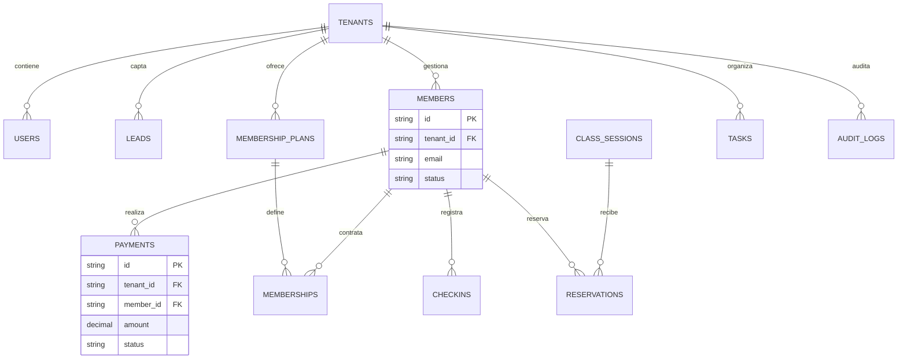

# Modelo de datos actual - Membora CRM

## Diagrama entidad-relación



Fecha de actualizacion: 30/06/2026.

## 1. Estado del documento

Este documento describe el modelo de datos usado por la version PHP actual. Sustituye al planteamiento inicial basado en Prisma/NestJS para reflejar la implementacion desplegable en Plesk.

La aplicacion usa una base de datos MariaDB compartida. Los datos operativos de cada gimnasio se aislan mediante `tenant_id`. La administracion SaaS de Membora CRM usa tablas globales de plataforma para leads web, clientes comerciales, empresas, planes y cobros.

## 2. Principios de datos

- Base de datos MariaDB unica.
- Identificadores de texto tipo CUID.
- Acceso a datos mediante PDO y consultas preparadas.
- Tablas operativas filtradas por `tenant_id`.
- Superadmin de plataforma sin `tenant_id` operativo propio.
- Creacion incremental de tablas/columnas auxiliares desde PHP cuando faltan.
- Sin migraciones Node, Prisma ni build en produccion.

## 3. Tablas operativas de gimnasio

Estas tablas pertenecen a un gimnasio concreto y deben consultarse siempre con `tenant_id`:

- `tenants`: gimnasio o centro cliente.
- `users`: usuarios internos del gimnasio y superadmin de plataforma.
- `roles`: catalogo global de roles.
- `pipeline_stages`: etapas comerciales.
- `leads`: leads del gimnasio.
- `lead_notes`: notas asociadas a leads.
- `members`: socios.
- `membership_plans`: planes de membresia.
- `subscriptions`: asignaciones de membresia a socios.
- `class_types`: tipos de clase.
- `class_sessions`: sesiones programadas.
- `reservations`: reservas de socios en clases.
- `tasks`: tareas comerciales u operativas.
- `task_members`: tabla historica de compatibilidad para tareas antiguas vinculadas a socios.
- `risk_alerts`: alertas generadas para priorizar riesgos operativos.
- `payments`: pagos manuales de socios, vencimientos y cobros.
- `billing_integrations`: configuracion de proveedor externo de facturacion por tenant.
- `billing_sync_logs`: registros de exportacion y sincronizacion de pagos.
- `checkins`: entradas/asistencias manuales de socios.
- `audit_logs`: registro de acciones internas con datos sanitizados.

Columnas auxiliares que PHP puede anadir:

- `users.avatar_path`.
- `members.photo_path`.
- `tenants.primary_color`.
- columnas de precio, periodicidad, duracion y estado en `membership_plans`.
- columnas de fecha y estado en `subscriptions`.
- columnas de descripcion, aforo, duracion y estado en `class_types`.
- columnas de tipo, instructor, inicio, fin, aforo y estado en `class_sessions`.

## 4. Tablas de administracion SaaS

Estas tablas son globales de Membora CRM y no representan datos internos de un gimnasio concreto:

- `platform_leads`: solicitudes recibidas desde la web publica.
- `platform_clients`: contactos comerciales antes de crear CRM.
- `empresas`: empresas cliente del SaaS, plan contratado, estado, pago y dias de prueba comercial.
- `empresa_payments`: cobros SaaS por empresa.
- `saas_plans`: catalogo comercial de planes SaaS.
- `webhook_settings`: configuracion historica/tecnica de integraciones.
- `webhook_logs`: registros tecnicos de formularios, emails y diagnosticos.

## 5. Relaciones principales

- `Tenant` 1 -> N `User`, `Lead`, `Member`, `MembershipPlan`, `ClassType`, `ClassSession`, `Task`.
- `Role` 1 -> N `User`.
- `PipelineStage` 1 -> N `Lead`.
- `Lead` 1 -> N `LeadNote`.
- `Lead` 0..1 -> 1 `Member` a nivel funcional mediante `members.lead_id`.
- `Member` 1 -> N `Subscription`.
- `Member` 1 -> N `Payment`.
- `Member` 1 -> N `CheckIn`.
- `BillingIntegration` 1 -> N `BillingSyncLog`.
- `MembershipPlan` 1 -> N `Subscription`.
- `Subscription` 0..N -> N `Payment`.
- `ClassType` 1 -> N `ClassSession`.
- `ClassSession` 1 -> N `Reservation`.
- `ClassSession` 0..N -> N `CheckIn`.
- `Member` 1 -> N `Reservation`.
- `Task` N -> 1 `User` mediante `assigned_user_id` como responsable interno.
- `Task` puede conservar enlaces historicos con `Member` mediante `task_members`, pero la interfaz actual prioriza usuarios internos.
- `RiskAlert` 0..N -> `Member`, `Lead`, `Task`, `Payment` o `ClassSession`.
- `AuditLog` 0..N -> `User` y opcionalmente a una entidad funcional mediante `entity_type` y `entity_id`.
- `PlatformLead` 0..1 -> 1 `PlatformClient` al convertir una solicitud web.
- `PlatformClient` 0..N -> N `Empresa` como origen comercial.
- `Empresa` 0..1 -> 1 `Tenant` cuando el CRM esta creado.
- `Empresa` 1 -> N `EmpresaPayment`.
- `SaasPlan` 1 -> N `Empresa` cuando se asigna un plan comercial.
- `Empresa.trial_days` define la duracion de la prueba cuando `plan` esta en `TRIAL`.

## 6. Reglas de aislamiento

- El `tenant_id` se obtiene desde la sesion autenticada, no desde formularios libres.
- Un usuario de gimnasio solo opera sobre su `tenant_id`.
- El superadmin puede entrar en modo soporte sobre una empresa conectada; durante ese modo la sesion fija el tenant objetivo.
- Las consultas de listados, ediciones y eliminaciones de gimnasio incluyen `tenant_id`.
- Las tablas globales de plataforma se protegen por rol de superadmin, no por `tenant_id`.
- Las rutas y acciones POST internas se validan contra una matriz de permisos por rol antes de ejecutarse.

## 7. Estados relevantes

Leads de gimnasio:

```text
OPEN, CONVERTED, LOST
```

Socios:

```text
ACTIVE, INACTIVE, AT_RISK, CANCELLED, PAYMENT_PENDING
```

Membresias y suscripciones:

```text
ACTIVE, INACTIVE, EXPIRED, CANCELLED
```

Clases:

```text
SCHEDULED, CANCELLED, COMPLETED
```

Reservas:

```text
reserved, cancelled, attended, no_show
```

Check-ins:

```text
MANUAL, QR
```

Tareas:

```text
PENDING, COMPLETED, CANCELLED
```

Alertas:

```text
OPEN, RESOLVED, DISMISSED
```

Leads web de plataforma:

```text
NEW, CONTACTED, QUALIFIED, CONVERTED, LOST
```

Clientes comerciales:

```text
LEAD, QUALIFIED, CUSTOMER, LOST
```

Empresas SaaS:

```text
ACTIVE, TRIAL, SUSPENDED, CANCELLED
```

Pagos SaaS:

```text
PAID, PENDING, OVERDUE, CANCELLED
```

Pagos de gimnasio:

```text
PAID, PENDING, OVERDUE, CANCELLED
```

Facturacion externa:

```text
ACTIVE, INACTIVE, PENDING, EXPORTED, SYNCED, ERROR, SUCCESS
```

## 8. Automatismos actuales

La aplicacion PHP puede crear o adaptar tablas auxiliares al cargar repositorios concretos. Esto permite desplegar cambios en Plesk con un `git pull` y sin ejecutar migraciones Node.

Automatismos principales:

- Crea `platform_leads`, `platform_clients`, `empresas`, `empresa_payments` y `saas_plans`.
- Crea `lead_notes`, `task_members`, `membership_plans`, `subscriptions`, `class_types`, `class_sessions` y `reservations`.
- Crea `checkins` para entradas manuales y asistencias asociadas a reservas.
- Crea `risk_alerts` para pagos vencidos, tareas vencidas, membresias caducadas o proximas a renovar, leads sin seguimiento, socios sin actividad y clases llenas.
- Crea `audit_logs` para registrar acciones POST internas, usuario, ruta, IP, navegador y datos sin contrasenas ni tokens.
- Crea `billing_integrations` y `billing_sync_logs` para configurar proveedor externo, exportar pagos y registrar sincronizaciones.
- Anade columnas de sincronizacion externa a `payments`.
- Anade `empresas.trial_days` para pruebas comerciales configurables.
- Crea `webhook_settings` y `webhook_logs` para integraciones y diagnostico.
- Anade columnas auxiliares de imagen, color, planes, clases y suscripciones si faltan.

Requisito operativo:

- El usuario MariaDB usado por `apps/crm/.env` debe tener permisos para `CREATE TABLE` y `ALTER TABLE` durante actualizaciones incrementales.

## 9. Fuera del alcance actual

No estan cerrados todavia como modulos completos de gimnasio:

- Pasarela de pagos real con cobro automatico.
