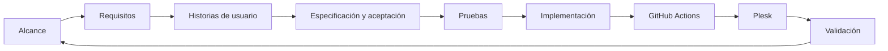
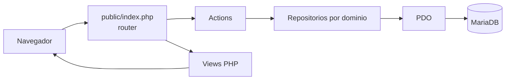
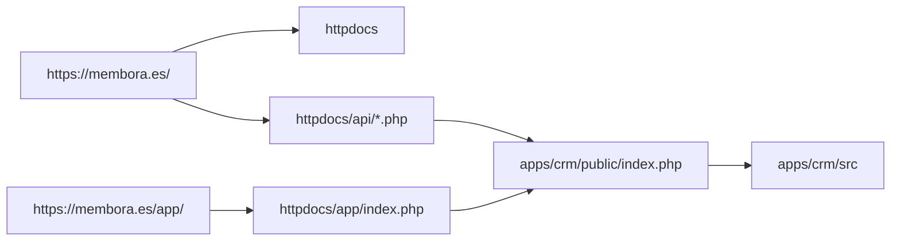
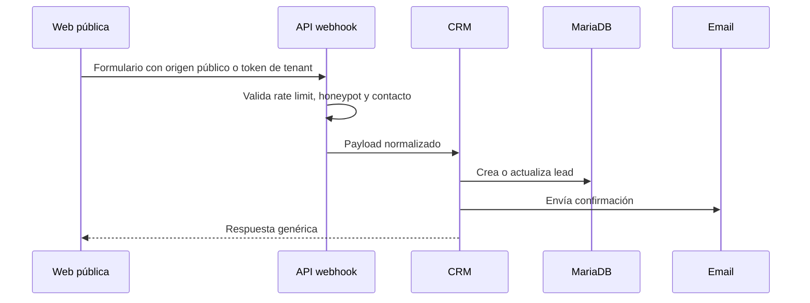
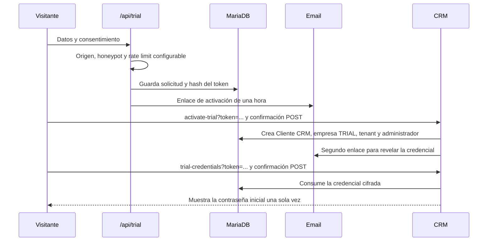
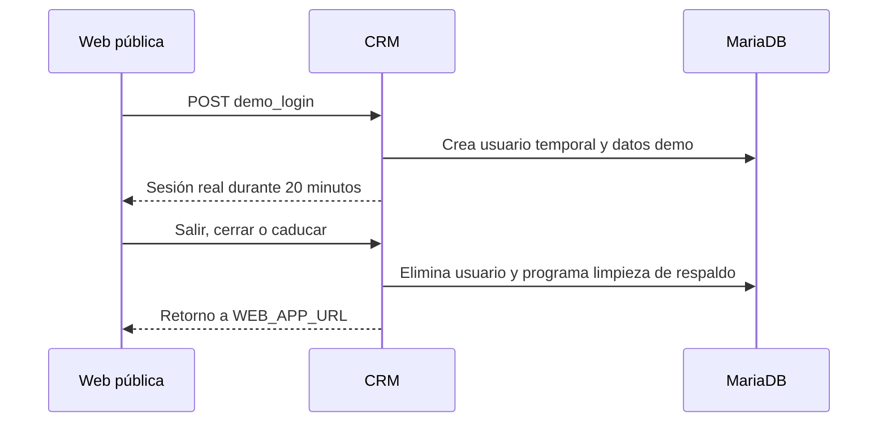
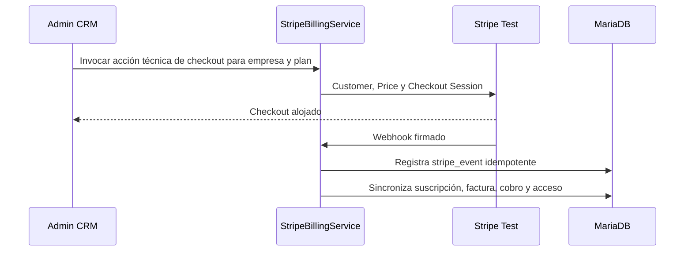
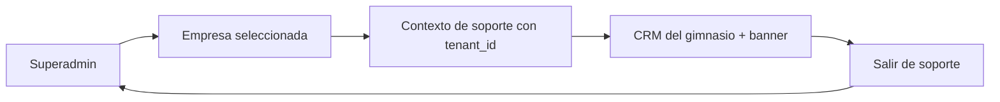

# Arquitectura y flujos

Fecha de actualización: 17/07/2026.

## Flujo metodológico

Este ciclo incremental se detalla en `docs/19-metodologia-desarrollo.md`.

## Arquitectura del CRM

## Despliegue bajo un único dominio

`httpdocs` es el único document root. El puente permite servir el CRM y sus recursos autorizados sin publicar directamente el código, la configuración ni los repositorios.

## Captación web

## Alta de prueba y recuperación

El limite especifico del alta se controla con `TRIAL_RATE_LIMIT_ENABLED` y esta desactivado por defecto durante la depuracion. La validacion de origen y el honeypot siguen siendo obligatorios. La entrega usa AES-256-GCM, cabeceras `no-store` y consumo previo a la visualizacion.

La recuperación ordinaria reutiliza `auth_tokens`: responde de forma neutra, envía un enlace temporal y revoca el token después de cambiar la contraseña.

## Demo temporal

## Stripe Billing de prueba

La URL de éxito no confirma el pago. Solo el webhook firmado modifica el estado financiero y de acceso. El código rechaza claves que no sean `sk_test_`; Stripe Live permanece pendiente.

La interfaz visible de empresas y facturas no muestra actualmente el bloque de diagnostico, el boton de Checkout ni la cancelacion directa en Stripe. El backend y el webhook de prueba se conservan como integracion tecnica, mientras la gestion diaria visible usa el estado local de renovacion.

Las cuentas `TRIAL` sí disponen de un recorrido especifico: el banner calcula los dias restantes, `upgrade-plan` muestra solo planes pagados y `create_tenant_stripe_checkout` obtiene la empresa desde la sesion. La eleccion se guarda en campos pendientes y Stripe recoge el metodo de pago. `invoice.paid` aplica el plan dentro de la transaccion que crea el pago y la factura de plataforma.

## Modo soporte multi-tenant

El tenant objetivo se obtiene de la empresa conectada y se guarda en sesión; no se acepta desde formularios libres de usuarios de gimnasio.
