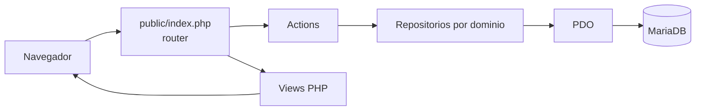
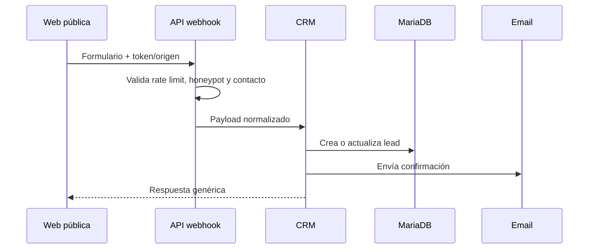

# Arquitectura y flujos

## Arquitectura del CRM

```mermaid
flowchart LR
    Browser[Navegador] --> Router[public/index.php<br/>router]
    Router --> Actions[Actions]
    Actions --> Repositories[Repositorios por dominio]
    Repositories --> PDO[PDO]
    PDO --> DB[(MariaDB)]
    Router --> Views[Views PHP]
    Views --> Browser
```

## Captación web

```mermaid
sequenceDiagram
    participant W as Web pública
    participant API as API webhook
    participant CRM as CRM
    participant DB as MariaDB
    participant M as Email
    W->>API: Formulario + token/origen
    API->>API: Valida rate limit, honeypot y contacto
    API->>CRM: Payload normalizado
    CRM->>DB: Crea o actualiza lead
    CRM->>M: Envía confirmación
    CRM-->>W: Respuesta genérica
```
